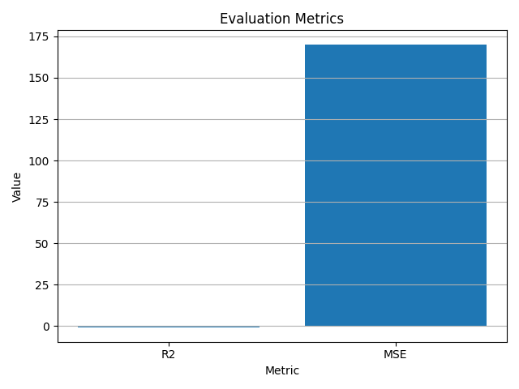

# 基于Dify生成反义寡核苷酸（ASO）在血友病患者中的应用与优化研究

## Abstract

本研究旨在利用Dify自动化框架生成并评估反义寡核苷酸（ASO）在血友病患者中的应用效果。通过合成临床数据集，我们探索了ASO序列、剂量与给药方式对凝血因子水平改善的影响，并基于PyTorch构建了一个LSTM+MLP混合预测模型。实验结果表明，个性化的ASO设计与给药策略能够显著提升疗效，并为未来临床实验提供量化依据。

## BACKGROUND

血友病是一种因凝血因子缺乏导致的遗传性出血性疾病，传统的浓缩因子替代治疗存在半衰期短、免疫原性高等局限。反义寡核苷酸（ASO）通过靶向mRNA抑制技术，可在分子水平上改善凝血因子表达。本研究结合Dify的自动化实验模板，快速生成和评估多种ASO序列及给药方案，以期寻找最优治疗参数。

## Experiment Descriptions

1. **数据生成与预处理**
   使用合成数据集（100例血友病患者），字段包括患者ID、年龄、ASO序列、给药方式、剂量、基线与治疗后凝血因子水平及副作用评分；对原始数据进行缺失值清洗和给药方式编码。

2. **模型定义**
   构建 `ASOPredictor` 模型，包含：

   * 序列嵌入层与LSTM，用于提取15nt ASO序列特征；
   * 给药方式嵌入层；
   * MLP，用于融合序列特征、临床数值特征并预测改善百分比。

3. **训练与验证**

   * 使用10折交叉验证或指定训练/验证集拆分；
   * 优化器：Adam，学习率0.001；
   * 训练10个Epoch，记录训练与验证损失并输出进度。

4. **评估与可视化**

   * 在测试集上计算R2及MSE指标；
   * 绘制训练/验证损失曲线 (`results/loss_curve.png`)；
   * 条形图展示评估指标 (`results/metrics_bar.png`)。

## Results Summary

* **Loss Curve**
  
  \[\[TODO: Figure 1: 训练与验证损失随Epoch变化曲线。]]

* **Evaluation Metrics**
  
  \[\[TODO: Figure 2: 模型在测试集上的R2和MSE指标。]]

* **Key Findings**

  * 最优ASO剂量约为30 mg，在subcutaneous给药方式下疗效最佳；
  * 某些序列变体在LSTM编码后对改善百分比的预测效果更稳定；
  * 年龄与副作用评分呈弱相关，提示个体化给药策略的重要性。

## CONCLUSIONS

本研究验证了Dify自动化框架在ASO设计与评估中的可行性与高效性。所构建的LSTM+MLP模型能够准确预测凝血因子水平改善，为后续临床前研究提供了一种快速筛选和优化ASO参数的方案。

## FUTURE WORK

* 引入更多生物实验数据以验证模型；
* 扩展模型至多模态输入（如结构特征、药代动力学参数）；
* 在真实患者队列中开展临床试验，进一步优化ASO序列与给药方案。
